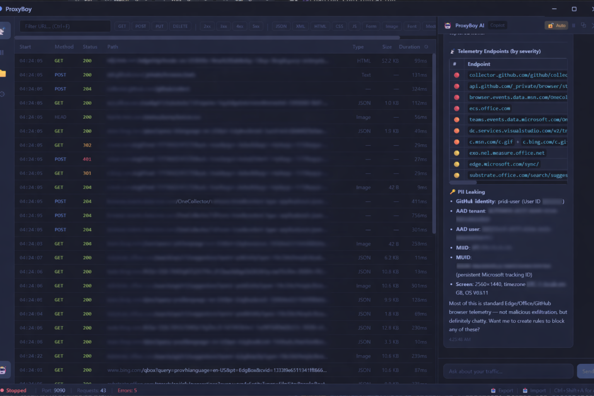
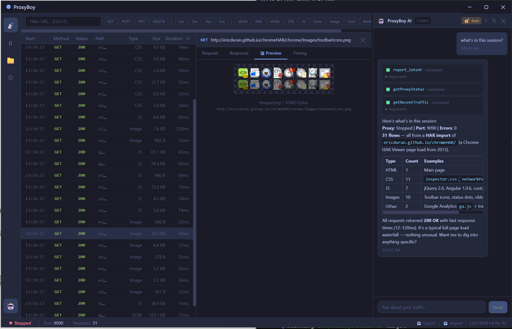
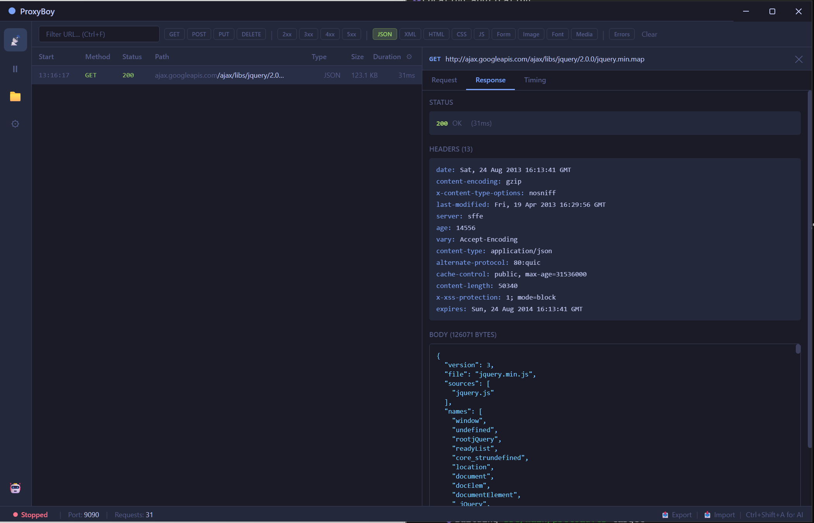
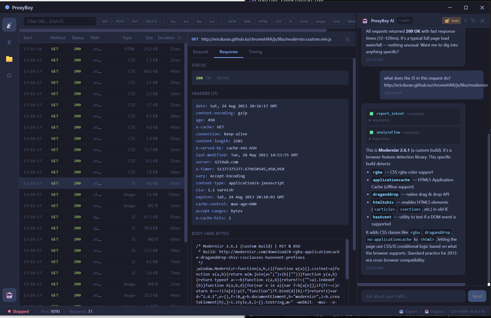

# 🧑‍💻 ProxyBoy

**A Windows-native HTTP/HTTPS debugging proxy with an AI-powered assistant, built with Electron.**

> ⚠️ **This is a personal/experimental project.** If you need a mature, production-ready HTTP debugging proxy, go check out **[Proxyman](https://proxyman.io/)** — it's excellent and was the direct inspiration for this project. ProxyBoy exists because I wanted a Windows-native alternative with agentic AI capabilities baked in, and I wanted to learn by building one.



---

## What is this?

ProxyBoy is a man-in-the-middle (MITM) HTTP/HTTPS proxy that captures, inspects, and modifies network traffic — similar to Charles Proxy, Fiddler, or Proxyman. What makes it different is the embedded AI assistant powered by the [GitHub Copilot SDK](https://github.com/features/copilot), which can analyze traffic, create rules, and help debug network issues conversationally.

### Features

- **Traffic Capture** — Intercept HTTP and HTTPS traffic with automatic SSL certificate generation
- **Request/Response Inspector** — View headers, bodies (JSON, HTML, XML, images), timing, and metadata
- **AI Assistant** — Chat panel powered by GitHub Copilot that can search traffic, analyze patterns, create rules, and export data
- **Breakpoint Rules** — Pause requests/responses mid-flight, inspect them, then forward or drop
- **Map Local Rules** — Serve local files instead of remote responses for mocking APIs
- **System Proxy Integration** — Toggle Windows system proxy on/off from the app
- **HAR Export/Import** — Standard HAR format for sharing captures with other tools
- **Configurable Columns** — Show/hide columns, sort by any field, timestamps
- **Replay Requests** — Repeat captured requests from the traffic list to reproduce problems quickly
- **Copy as cURL** — Right-click any request to copy it as a cURL command
- **Dark Theme** — Tokyo Night-inspired dark UI
- **Detachable AI Panel** — Pop the assistant out into its own window

### In Action

**HAR Import + Image Preview + AI Session Analysis**

Import a HAR file, preview images inline, and ask the AI assistant to break down what's in the capture.

**Content Type Filtering + JSON Body Viewer**

Filter traffic by content type (JSON, HTML, CSS, JS, images, etc.) and inspect formatted response bodies.

**AI-Powered Request Analysis**

Select any request and ask the AI to explain it — it calls tools like `analyzeFlow` to inspect headers, body, and context, then gives you a human-readable breakdown.

### AI Assistant Tools

The embedded Copilot agent has access to these tools:

| Tool | Description |
|------|-------------|
| `getRecentTraffic` | Fetch the latest captured flows |
| `searchTraffic` | Search flows by URL, body, or headers |
| `getErrorFlows` | Find all 4xx/5xx responses |
| `getFlowDetails` | Deep-dive into a specific request |
| `createBreakpointRule` | Create a breakpoint to pause matching traffic |
| `createMapLocalRule` | Mock an API endpoint with a local file |
| `exportHar` | Export captured traffic as HAR |
| `controlProxy` | Start or stop the proxy engine |

Tool execution can be auto-approved or require manual confirmation per-call.

---

## Tech Stack

- **Electron** + **React** + **TypeScript**
- **[http-mitm-proxy](https://github.com/joeferner/node-http-mitm-proxy)** — MITM proxy engine
- **[@github/copilot-sdk](https://github.com/features/copilot)** — AI agent capabilities
- **[sql.js](https://github.com/sql-js/sql.js)** — SQLite in-process for persistence
- **[Tailwind CSS](https://tailwindcss.com/)** — Styling
- **[react-virtuoso](https://virtuoso.dev/)** — Virtualized traffic list
- **Electron Forge** — Build and packaging

---

## Getting Started

### Prerequisites

- **Windows 10/11**
- **Node.js 20+**
- **GitHub Copilot subscription** (for the AI assistant — the proxy works without it)

### Install & Run

```bash
git clone https://github.com/pjperez/proxyboy.git
cd proxyboy
npm install
npm start
```

### Build Installer

```bash
npm run build
```

Output goes to `out/make/`.

### Usage

1. **Start the proxy** — Click the play button in the status bar or use the AI assistant
2. **Route traffic** — Either toggle "System Proxy" in settings, or manually configure your browser/app to use `127.0.0.1:9090`
3. **Inspect** — Click any row to see request/response details
4. **Create rules** — Use the Breakpoints or Map Local views, or ask the AI assistant
5. **AI Assistant** — Click the robot icon in the sidebar or press `Ctrl+Shift+A`

### SSL/HTTPS

To inspect HTTPS traffic, you'll need to trust ProxyBoy's root CA certificate:

1. Go to **Settings** → **Install Certificate**
2. This installs a local root CA into the Windows certificate store
3. Restart your browser after installing

The certificate is generated locally and stored in your user profile. It never leaves your machine.

---

## Project Structure

```
src/
├── main/              # Electron main process
│   ├── proxy/         # MITM proxy engine, interceptor, certificate manager
│   ├── agent/         # Copilot SDK client, tools, prompts
│   ├── ipc/           # IPC handlers between main ↔ renderer
│   ├── storage/       # SQLite database, queries
│   └── utils/         # Windows proxy settings, HAR export
├── renderer/          # React UI
│   ├── components/    # Traffic list, detail view, agent panel, rules editors
│   ├── stores/        # Zustand state management
│   └── utils/         # cURL generation, helpers
└── shared/            # Types, constants shared between main & renderer
```

---

## Known Limitations

- **Windows only** — System proxy integration uses Windows registry; the rest could theoretically work cross-platform
- **No request/response editing in breakpoints** — You can inspect and forward/drop, but not modify (yet)
- **SSL inspection quirks** — Some sites with certificate pinning or HSTS preload may not work through the proxy
- **Cloudflare challenges** — Sites behind Cloudflare browser challenges will typically fail through any MITM proxy
- **Very limited automated tests** — There is a small test foothold now, but coverage is still far from production-ready 🙃

---

## Acknowledgments

- **[Proxyman](https://proxyman.io/)** — The primary inspiration. Seriously, go use Proxyman if you want a polished, reliable proxy tool. It's great.
- **[Charles Proxy](https://www.charlesproxy.com/)** and **[Fiddler](https://www.telerik.com/fiddler)** — Other excellent tools in this space
- **[GitHub Copilot](https://github.com/features/copilot)** — Powers the AI assistant, and also helped build this entire app

---

## License

MIT — Do whatever you want with it.
